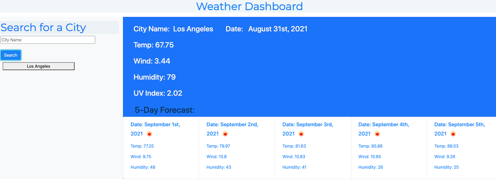
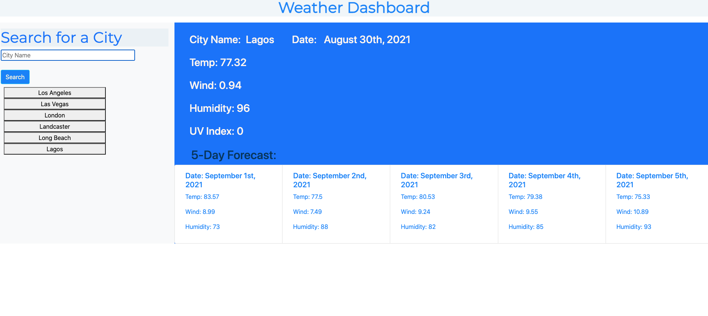

#  Weather Dashboard

# Table of Contents

* [Description](#description)
* [Installation](#instalation)
* [Usage](#usage)
* [Tools](#tools)
* [Contact](#contact)
* [License](#license)
* [Acknowledgements](#acknowledgements)

## Description 

This application can be useful to many, particularly travelers who want to see the weather outlook for multiple cities in order to plan ahead.  

## Instalation

For installation and deployment, please [click here](https://kimberly-rodriguez.github.io/Kimberlys_Protfolio/). The GitHub link is [here](https://github.com/Kimberly-Rodriguez/Kimberlys_Protfolio).

## Usage

This application will show the following functionalities:
 
- The weather dashboard with form inputs

- The search bar will show the current and future conditions for that city and that city is added to the search history

- The current weather conditions for that city shows the city name, the date, an icon representation of weather 
conditions, the temperature, the humidity, the wind speed, and the UV index

- The view of the UV index shows a color that indicates whether the conditions are favorable, moderate, or severe

- The future weather conditions for that city shows a 5-day forecast that displays the date, an icon representation of weather conditions, the temperature, the wind speed, and the humidity

- The "on click" for a city in the search history will show current and future conditions for that city

The following image shows the web application's appearance and functionality:

 
 

## Tools

* This project was built using HTML, CSS and JavaScript principles. As well as, usage of the [OpenWeather One Call API](https://openweathermap.org/api/one-call-api) to retrieve weather data for cities. 

* This project used `localStorage` to store any persistent data. 

## Contact

If you have any question about my work or wish to collaborate in the future please contact me at: <krodriguez.ucla@gmail.com>

## License 

Licensed under the [MIT License](LICENSE).

## Acknowledgements
[UCLA Extension Coding Bootcamp](https://bootcamp.uclaextension.edu/coding/)
