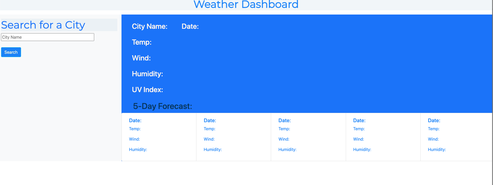

#  Weather Dashboard

To build a weather dashboard that will run in the browser and feature updated HTML and CSS. As well as, usage of the [OpenWeather One Call API](https://openweathermap.org/api/one-call-api) to retrieve weather data for cities. 

This project used `localStorage` to store any persistent data. 

This application can be useful to many, particularly travelers who want to see the weather outlook for multiple cities in order to plan ahead.  

This application will show/docuduct the following functionalities:
 
- The weather dashboard with form inputs

- The search bar will show the current and future conditions for that city and that city is added to the search history

- The current weather conditions for that city shows the city name, the date, an icon representation of weather 
conditions, the temperature, the humidity, the wind speed, and the UV index

- The view of the UV index shows a color that indicates whether the conditions are favorable, moderate, or severe

- The future weather conditions for that city shows a 5-day forecast that displays the date, an icon representation of weather conditions, the temperature, the wind speed, and the humidity

- The "on click" for a city in the search history will show current and future conditions for that city

## The following image shows the web application's appearance and functionality:

 
 

